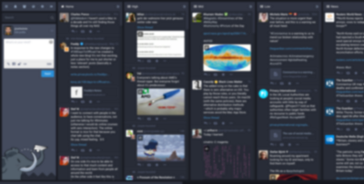
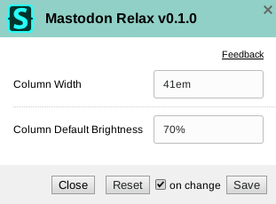

Mastodon Relax
==============

|version|

A relaxed view for Mastodon's advanced interface. Features:

- Customizable wider columns
- Dim columns by default, and brighten on hover

Preview
-------

======== ========
Before   After
======== ========
|image0| |image1|
======== ========

Customization
-------------

Edit the regular expression if your mastodon instance does not start with
``https://mastodon.*``.  Other CSS parameters may be dynamically set within the
`Stylus <https://add0n.com/stylus.html>`__\ ’ `configuration
popup <https://github.com/openstyles/stylus/wiki/Popup>`__.

|image2|

Installation
------------

A userstyle extension is required, common ones include:

🎨 Stylus for `Firefox
<https://addons.mozilla.org/en-US/firefox/addon/styl-us/>`__, `Chrome
<https://chrome.google.com/webstore/detail/stylus/clngdbkpkpeebahjckkjfobafhncgmne>`__
or `Opera <https://addons.opera.com/en-gb/extensions/details/stylus/>`__.

🎨 xStyle for `Firefox <https://addons.mozilla.org/firefox/addon/xstyle/>`__ or
`Chrome
<https://chrome.google.com/webstore/detail/xstyle/hncgkmhphmncjohllpoleelnibpmccpj>`__.

Then:

📦 `Install the
usercss <https://github.com/ashwinvis/mastodon-relax/raw/master/mastodon-relax.user.css>`__
with Stylus or xStyle. Supports automatic updates.

Contributions
-------------

If you would like to contribute to this repository, please…

1. 🍴 `Fork <https://github.com/ashwinvis/mastodon-relax/fork>`__,
   or 🔽 `Download <https://github.com/ashwinvis/mastodon-relax/archive/master.zip>`__,
2. 👌 Create a pull request!

.. |version| image:: https://img.shields.io/github/v/tag/ashwinvis/mastodon-relax

.. |image1| image:: ./images/after.png
    :width: 80%

